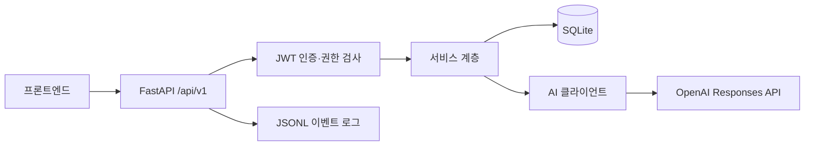

# B7-1 AI 챗봇 백엔드

웹 기반 AI 챗봇 서비스의 FastAPI 백엔드입니다. 회원가입·로그인·로그아웃, 사용자별 채팅방과 대화 기록, AI 답변 생성, 관리자 조회를 제공합니다.

## 시스템 구성



Python 3.12 이상, uv, SQLAlchemy 비동기 세션, aiosqlite, Pydantic을 사용합니다. 비밀번호는 Argon2로 해시하고 인증은 HS256 JWT를 사용합니다. 채팅은 최근 성공 대화 최대 5건을 문맥에 포함하며, 답변을 저장한 뒤 일반 JSON 응답을 반환합니다.

## 로컬 실행

uv 설치는 [개발 환경 안내](docs/GETTING_STARTED.md)를 참고합니다. 저장소 루트에서 실행합니다.

```bash
uv sync --locked
cp .env.example .env
openssl rand -hex 32
```

`.env`의 `OPENAI_API_KEY`에 실제 API 키를, `JWT_SECRET_KEY`에 위 명령으로 생성한 값을 입력합니다. `OPENAI_MODEL`은 사용할 모델 ID로 설정합니다. 예시 파일의 빈 비밀값을 그대로 두면 정상 동작하지 않습니다.

```bash
uv run uvicorn app.main:app --reload --host 127.0.0.1 --port 8000
curl http://127.0.0.1:8000/health
```

- 헬스 체크: `/health` → `{"status":"ok"}` (DB 연결 검사)
- Swagger: `http://127.0.0.1:8000/docs`
- ReDoc: `http://127.0.0.1:8000/redoc`
- SQLite 기본 위치: 저장소 루트의 `app.db` (시작 시 없는 테이블 생성)

## 테스트와 배포

```bash
uv run pytest
make todos
```

서버 환경 변수와 DB·로그의 영속 경로를 준비한 뒤 다음과 같이 실행할 수 있습니다. HTTPS, 프록시, 프로세스 관리 설정은 배포 환경에 맞게 구성합니다.

```bash
uv sync --locked
uv run uvicorn app.main:app --host 0.0.0.0 --port 8000
```

저장소에 배포 자동화 설정은 없습니다. 배포 절차와 검증 항목은 [운영 안내](docs/OPERATIONS.md)를 참고합니다.

## 문서

| 문서 | 내용 |
| --- | --- |
| [API](docs/API.md) | 요청·응답, 인증, 접근 제어, 검증, 오류 |
| [데이터베이스](docs/DATABASE.md) | ERD, 필드, 대화 기록 저장·조회 |
| [아키텍처](docs/ARCHITECTURE.md) | 시스템 구성, AI 흐름, 최근 5건 문맥 |
| [팀 작업](docs/TEAM.md) | 작업 기록, 브랜치 전략, PR·커밋 증빙 |
| [운영](docs/OPERATIONS.md) | 환경 변수, 배포, 로그, 장애·검증 |
| [개발 환경](docs/GETTING_STARTED.md) | uv 설치와 에디터 설정 |
| [관리자 상세](docs/admin.md) | 관리자 API 구현 |
| [로그 형식](docs/system-logs.md) | 시스템 이벤트 로그 계약 |
| [회원가입 상세](docs/auth.md) | 회원가입 규칙 |
| [채팅 요구사항](docs/PRD/AI-CHAT-PRD.md) / [계약](docs/PRD/AI-CHAT-API.md) | 기획과 채팅 API 명세 |

문서는 현재 `main`의 구현 기준입니다. 요구사항 문서의 계획과 실제 동작이 다르면 API·모델·테스트를 함께 확인합니다.

## 관련 저장소

- [백엔드](https://github.com/myy-dev/be-B7-1)
- [프론트엔드](https://github.com/myy-dev/fe-B7-1)
