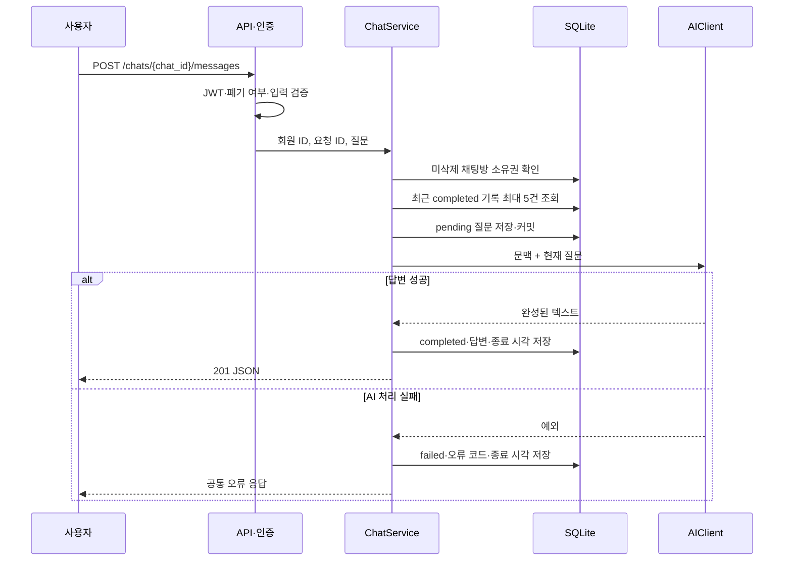

# 아키텍처

## 계층과 수명주기

| 위치 | 책임 |
| --- | --- |
| `app/main.py` | 앱 설정, CORS, 시작·종료 처리 |
| `app/api/` | 라우팅, 입력·응답 스키마 연결, 인증 의존성 |
| `app/services/` | 소유권 확인, 회원·채팅·관리자 처리 |
| `app/repositories/` | DB 트랜잭션과 조회, 시스템 로그 파일 조회 |
| `app/models/`, `app/schemas/` | 저장 모델, 입력 검증·응답 계약 |
| `app/clients/ai.py` | 비동기 AI 호출과 오류 변환 |
| `app/core/` | 환경 설정, DB, JWT, 요청 ID, 로그, 공통 오류 |

앱 시작 시 `create_all`로 없는 테이블을 생성하고 AI 클라이언트를 한 번 생성해 공유합니다. 요청별 DB 세션을 사용하고 종료 시 AI 연결과 DB 엔진을 정리합니다. 스키마 변경 마이그레이션은 별도 구현되어 있지 않습니다.

## 질문 처리 흐름

AI 호출 동안 DB 트랜잭션을 열어두지 않습니다. 실패 상태 저장도 DB 장애로 실패할 수 있으며, 프로세스 중단이나 결과 저장 실패로 `pending` 기록이 남을 수 있습니다.

## 최근 대화 5개 문맥 전략

`ChatRepository.list_recent_completed`는 해당 채팅방의 `completed` 기록만 `created_at DESC, request_id DESC`로 정렬해 5건을 가져온 뒤 순서를 뒤집습니다. AI에는 오래된 질문·답변부터 `user`, `assistant` 메시지로 번갈아 넣고 마지막에 현재 질문을 추가합니다.

- 5개는 질문·답변 쌍 5건입니다. 이전 메시지 최대 10개와 현재 질문 1개가 전달됩니다.
- `pending`, `failed`, 다른 채팅방 기록은 제외합니다.
- 전체 기록은 DB에 보존합니다. 문맥 제한이 저장 기록 삭제를 의미하지 않습니다.
- 호출마다 문맥을 다시 구성하며 `store=False`를 전달합니다. 스트리밍과 자동 재시도는 사용하지 않습니다.
- 토큰 수에 따른 문맥 축약, 질문 최대 길이, 같은 채팅방 동시 요청 잠금은 구현되어 있지 않습니다. `CHAT_BUSY` 코드는 정의되어 있으나 현재 발행 경로가 없습니다.

인증·접근 제어는 [API](API.md), 저장 구조는 [DATABASE](DATABASE.md), 실패 대응은 [OPERATIONS](OPERATIONS.md)를 참고합니다.
