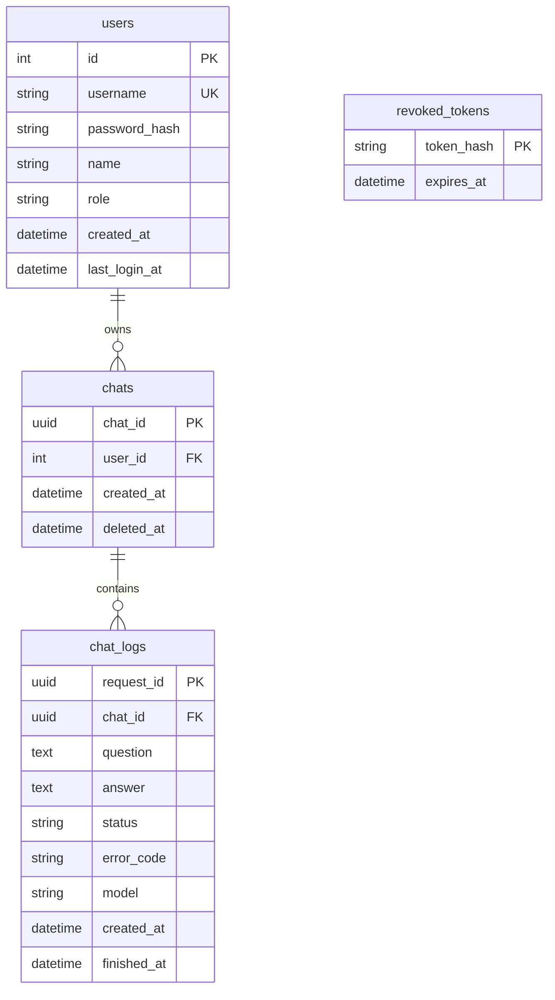

# 데이터베이스

기본 DB는 `sqlite+aiosqlite`이며 `DATABASE_URL`로 파일 위치를 지정합니다. 현재 연결 초기화에 SQLite 전용 `PRAGMA foreign_keys=ON`이 있으므로 다른 DB로 전환하려면 드라이버와 초기화 코드를 함께 변경해야 합니다.

## ERD



`revoked_tokens`는 회원 외래키 없이 폐기한 토큰 해시를 보관합니다.

## 테이블·필드

| 테이블 | 필드와 의미 |
| --- | --- |
| `users` | `id`: 정수 PK; `username`: 고유 아이디(최대 20자); `password_hash`: 해시(255자); `name`: 이름(50자); `role`: 기본 `user`, 관리자 `admin`; `created_at`: 가입 시각; `last_login_at`: 마지막 로그인, nullable |
| `chats` | `chat_id`: UUID PK; `user_id`: `users.id` FK; `created_at`: 생성 시각; `deleted_at`: 논리 삭제 시각, nullable |
| `chat_logs` | `request_id`: 최초 질문 요청의 UUID PK; `chat_id`: `chats.chat_id` FK; `question`: 질문; `answer`: 답변, nullable; `status`: 처리 상태; `error_code`: 실패 코드, nullable; `model`: 호출 모델; `created_at`: 질문 저장 시각; `finished_at`: 종료 시각, nullable |
| `revoked_tokens` | `token_hash`: 토큰 SHA-256 해시(64자) PK; `expires_at`: 토큰 만료 시각 |

채팅 시각은 UTC로 다루고 API에 UTC 시각으로 반환합니다. 조회 인덱스는 `chats(user_id, created_at, chat_id)`와 `chat_logs(chat_id, created_at, request_id)`입니다.

## 대화 로그 저장

질문당 한 행을 저장하고 같은 행의 처리 결과를 갱신합니다. DB 체크 제약이 다음 상태 조합을 검사합니다.

| 상태 | answer | error_code | finished_at |
| --- | --- | --- | --- |
| `pending` | null | null | null |
| `completed` | 답변 | null | 종료 시각 |
| `failed` | null | 오류 코드 | 종료 시각 |

질문과 결과는 각각 커밋합니다. SQLAlchemy 저장 예외는 롤백한 뒤 공통 `DB_ERROR`로 처리합니다. 서버가 중단된 `pending` 기록을 자동 복구하는 작업은 없습니다.

## 조회와 삭제

- 사용자: `GET /api/v1/chats/{chat_id}`로 본인 미삭제 채팅방의 모든 상태 기록을 생성 시각·요청 ID 오름차순으로 조회합니다.
- AI 문맥: 성공 기록 최근 5건만 조회해 오래된 순으로 사용합니다.
- 관리자: `/api/v1/admin/logs`의 회원·기간 필터, `/admin/sessions?user_id=...`, `/admin/sessions/{chat_id}`를 사용합니다. 세션 제목은 첫 질문에서 구성합니다.
- `DELETE /api/v1/chats/{chat_id}`는 `deleted_at`만 설정합니다. 기록을 물리 삭제하지 않으며 사용자 조회에서는 제외됩니다. 관리자 DB 조회에는 삭제 필터가 없어 보존 기록을 조회할 수 있습니다.

운영 DB 확인 예시(SQLite UUID는 하이픈 없는 형태로 저장):

```sql
SELECT request_id, chat_id, status, error_code, created_at, finished_at
FROM chat_logs
ORDER BY created_at DESC, request_id DESC
LIMIT 20;
```

`create_all`은 기존 테이블의 필드를 변경하지 않습니다. 모델 변경 시 별도 마이그레이션과 백업 계획이 필요합니다. DB 백업·보관은 [운영 안내](OPERATIONS.md)를 참고합니다.
